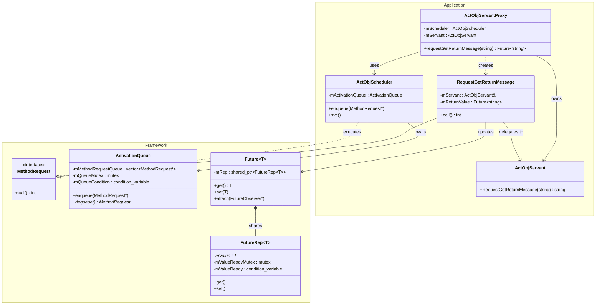
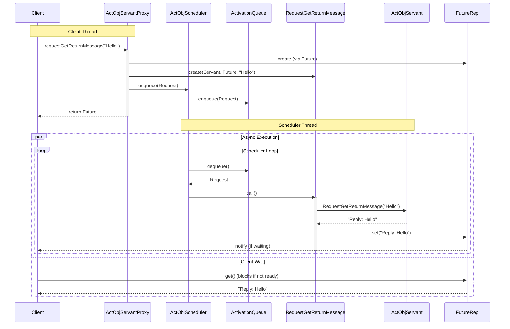

# Active Object — Design Documentation

- **Author:** Jake Yoo
- **Date:** 2025-12-26
- **Version:** 0.1
- **Status:** Draft

## 1. Introduction
This document describes the design and architecture of the Active Object framework and its example application. The Active Object pattern decouples method execution from method invocation for objects that each reside in their own thread of control. The goal is to introduce concurrency by using asynchronous method invocation and a scheduler to handle requests.

## 2. Architecture Overview
The architecture is divided into two main layers: the **Framework Layer** and the **Application Layer**.

- **Framework Layer**: Provides the generic components for the Active Object pattern, including the activation queue, method request interface, and future mechanism.
- **Application Layer**: Implements the specific business logic and adapts the framework components to the application's needs.

### High-Level Class Diagram

## 3. Component Design

### 3.1 Framework Components

#### 3.1.1 ActivationQueue
The `ActivationQueue` is a thread-safe queue that buffers `MethodRequest` objects. It acts as the synchronization point between the client thread (producer) and the scheduler thread (consumer).

- **Synchronization**: Uses `std::mutex` to protect the internal `std::vector` and `std::condition_variable` to block the consumer when the queue is empty.
- **Lifecycle**: Supports a shutdown state (`STATE_SHUTDOWN`) to gracefully exit the consumer loop.

#### 3.1.2 MethodRequest
`MethodRequest` is an abstract base class (interface) that encapsulates a method call. It follows the **Command Pattern**.

- **Responsibility**: It holds the necessary context (arguments, reference to the servant, and the future) to execute a specific method on the servant.
- **Interface**: Defines a pure virtual `call()` method that must be implemented by concrete request classes.

#### 3.1.3 Future & FutureRep
The `Future<T>` class provides a proxy for a result that is initially unknown. It uses a "pimpl" (pointer to implementation) idiom via `FutureRep<T>` to share the state between the producer (MethodRequest) and the consumer (Client).

- **FutureRep**: Holds the actual value and the synchronization primitives (`mutex`, `condition_variable`). It manages the `wait` logic for the `get()` operation.
- **Observer Support**: Supports the Observer pattern via `FutureObserver`, allowing clients to be notified asynchronously when the result is ready instead of blocking.

### 3.2 Application Components

#### 3.2.1 ActObjServantProxy
The proxy exposes the application's API to the client. It runs in the client's thread.

- **Role**: Converts method calls into `MethodRequest` objects (e.g., `RequestGetReturnMessage`).
- **Action**: Enqueues the request into the `ActObjScheduler` and immediately returns a `Future<T>` to the client.

#### 3.2.2 ActObjScheduler
The scheduler runs in a separate thread (inheriting from `Task`).

- **Execution Loop (`svc`)**: Continuously dequeues `MethodRequest` objects from the `ActivationQueue`.
- **Processing**: Executes the `call()` method on the dequeued request.
- **Ownership**: Owns the `ActivationQueue`.

#### 3.2.3 ActObjServant
The servant implements the actual business logic.

- **Concurrency**: It is designed to be unaware of the concurrency model. Its methods are invoked synchronously by the `MethodRequest` within the scheduler's thread.

#### 3.2.4 RequestGetReturnMessage
A concrete implementation of `MethodRequest`.

- **Execution**: In its `call()` method, it invokes `RequestGetReturnMessage` on the `ActObjServant`.
- **Result Handling**: It captures the return value and sets it on the `Future<string>`, which wakes up any waiting clients.

## 4. Execution Flow

The following sequence diagram illustrates the end-to-end flow of an asynchronous method call.

## 5. Source Code References
- **Framework Implementation**: [`framework/active_object/1_0/`](../../framework/active_object/1_0/)
- **Example Application**: [`applications/example_active_object/`](../../applications/example_active_object/)
