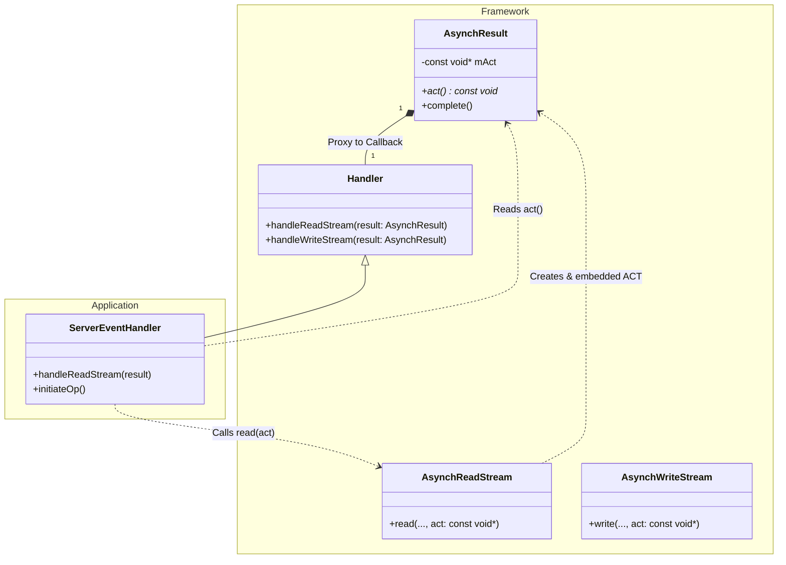
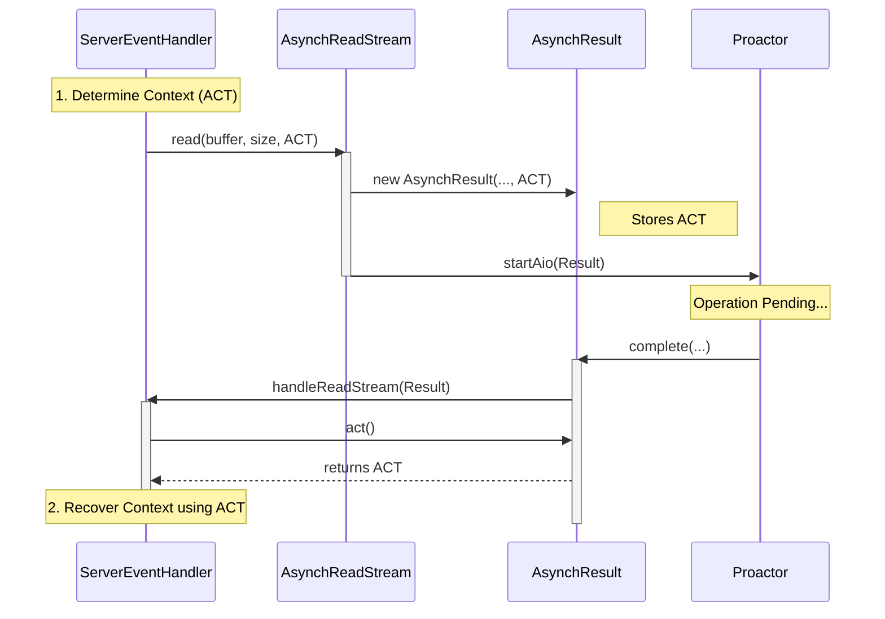

# Asynchronous Completion Token — Design Documentation

- **Title:** Asynchronous Completion Token — Design Documentation
- **Author:** Jake Yoo
- **Date:** 2026-01-25
- **Version:** 0.1
- **Status:** Draft

## 1. Summary
This document outlines the design and implementation of the **Asynchronous Completion Token (ACT)** design pattern within the Proactor framework. It describes how applications can efficiently associate state with asynchronous operations and retrieve it upon completion without blocking or using threading overhead.

## 2. Goals & Non-Goals
- **Goals:**
  - Document the implementation of the Asynchronous Completion Token (ACT) pattern.
  - Explain how the ACT is passed through the asynchronous operation lifecycle.
  - Demonstrate the usage of ACT within the context of the example application.
  - Provide architectural visualizations using Mermaid diagrams.

- **Non-Goals:**
  - Detailed Proactor pattern documentation (covered in specific Proactor design specs).
  - Detailed Reactor pattern documentation.

## 3. Architecture Overview

The **Asynchronous Completion Token (ACT)** pattern allows an application to efficiently associate state with the completion of asynchronous operations. In this framework, the ACT is a `const void *` pointer that is passed by the initiator of an operation and returned to the completion handler.

### 3.1. Key Components

-   **AsynchResult (`framework/proactor/1_0/AsynchResult`)**:
    -   Acts as the container for the ACT.
    -   Stores the `act` provided during the operation initiation.
    -   Provides the `act()` accessor method for the completion handler to retrieve the token.
    
-   **AsynchReadStream / AsynchWriteStream**:
    -   The *Initiators*.
    -   The `read()` and `write()` methods accept an optional `act` parameter (default `0`).
    -   These methods create an `AsynchResult` object, embedding the provided `act`.

-   **Proactor**:
    -   The *Dispatcher*.
    -   When an operation completes, the Proactor retrieves the corresponding `AsynchResult`.
    -   It invokes `complete()` on the result, which in turn calls the application's handler.

-   **Handler (`framework/proactor/1_0/Handler`)**:
    -   The *Completion Handler*.
    -   Receives the fully populated `AsynchResult` (including the ACT) in the callback methods (`handleReadStream`, `handleWriteStream`).
    -   Can cast the `act()` back to its original type to recover context.

### 3.2. Example Application Usage

In the example application (`applications/example_proactor`), the `ServerEventHandler` acts as the `ServiceHandler`. While the basic example might use `nullptr` for simple operations, the infrastructure supports complex state management:

1.  **Initiation**: When `ServerEventHandler` calls `mReader.read(...)`, it can pass a pointer to a state object (e.g., a session ID, a request object, or a specific buffer context) as the `act`.
2.  **Processing**: The framework performs the I/O asynchronously.
3.  **Completion**: When `handleReadStream` is called, the handler inspects `result.act()`. This allows a single handler to distinguish between multiple concurrent operations or to recall specific context for the completed specific operation.

## 4. Design Diagrams

### 4.1. Class Diagram

This diagram focuses on the classes involved in transporting the Asynchronous Completion Token.

### 4.2. Sequence Diagram

The sequence below illustrates the lifecycle of the ACT: from passing it during initiation to retrieving it during completion.

