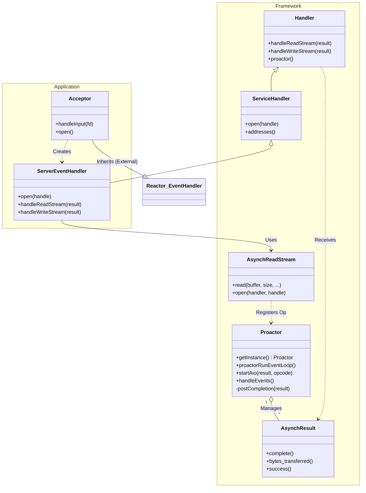

# Proactor — Design Documentation

- **Title:** Proactor — Design Documentation
- **Author:** Jake Yoo
- **Date:** 2026-01-25
- **Version:** 0.1
- **Status:** Draft

## 1. Summary
This document outlines the design and implementation of the Proactor design pattern within the framework. It also describes the example application that demonstrates the usage of the Proactor framework for handling asynchronous I/O operations.

## 2. Goals & Non-Goals
- **Goals:**
  - Document the architecture and components of the Proactor framework implementation.
  - Describe the interaction between the Proactor framework and the example application.
  - Provide clear architectural visualizations using Mermaid diagrams (Class and Sequence diagrams).

- **Non-Goals:**
  - Complete documentation of the Reactor pattern (only referenced as it relates to the connection acceptance in the example).
  - Detailed POSIX AIO documentation (underlying mechanism is abstracted).

## 3. Architecture Overview

The system is divided into two main parts:
1.  **Proactor Framework**: A reusable set of classes implementing the Proactor pattern, handling asynchronous operation initiations and completion dispatching.
2.  **Example Application**: A server utilizing the Proactor framework to handle client connections and echoing messages.

### 3.1. Proactor Framework (`framework/proactor/1_0`)

The Core components of the Proactor framework are:

-   **Proactor**: The singleton component that manages the event loop (`proactorRunEventLoop`). It processes asynchronous operations, handles completion events, and dispatches them to the appropriate handlers.
-   **Handler**: An abstract base class for application-defined event handlers. It defines virtual methods like `handleReadStream` and `handleWriteStream` to process operation completions.
-   **ServiceHandler**: Extends `Handler` to support connection initialization (`open`).
-   **AsynchResult**: Represents the result of an asynchronous operation. It contains the status, bytes transferred, and acts as a carrier for the completion callback to the `Handler`.
-   **AsynchReadStream / AsynchWriteStream**: Factory classes used by applications to initiate asynchronous read and write operations. They register the request with the `Proactor`.

### 3.2. Example Application (`applications/example_proactor`)

The example application demonstrates a hybrid approach where:
-   **Acceptor**: Uses the **Reactor** pattern to synchronously listen for and accept new TCP connections. Upon acceptance, it creates a `ServerEventHandler` and hands over the new socket to the Proactor framework.
-   **ServerEventHandler**: A concrete `ServiceHandler` that manages the lifecycle of a client connection. It initiates asynchronous reads and writes using `AsynchReadStream` and `AsynchWriteStream`.

## 4. Design Diagrams

### 4.1. Class Diagram

The following diagram illustrates the relationship between the Proactor framework classes and the application classes.

### 4.2. Sequence Diagram

The sequence below depicts the flow of a new client connection:
1.  Establishment via `Acceptor` (Reactor thread).
2.  Handover to `ServerEventHandler` (Proactor).
3.  Asynchronous Read initiation.
4.  Completion dispatch by `Proactor` (Proactor thread).

## 5. Implementation Details

-   **Architecture**: POSIX AIO (or emulated AIO) is used as the underlying mechanism (abstracted by the framework).
-   **Concurrency**: 
    -   The **Reactor** runs in its own thread to handle connection events.
    -   The **Proactor** runs in a separate thread to handle I/O completion events.
    -   Thread safety is managed via mutexes within the Proactor singleton when managing the operation queue.
