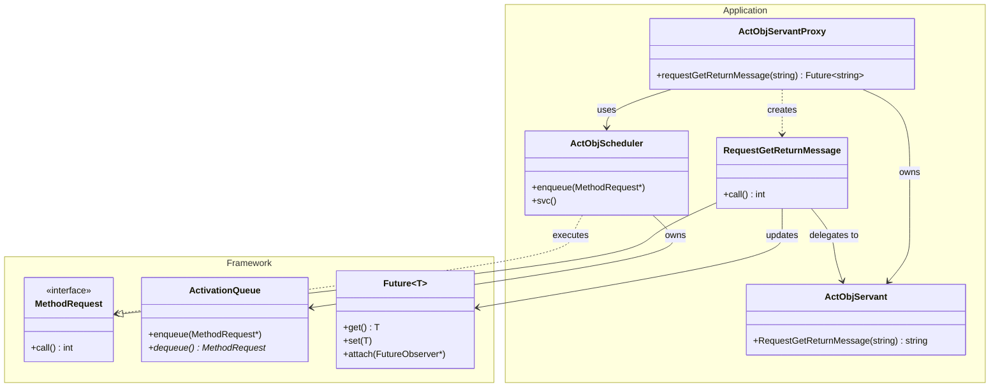
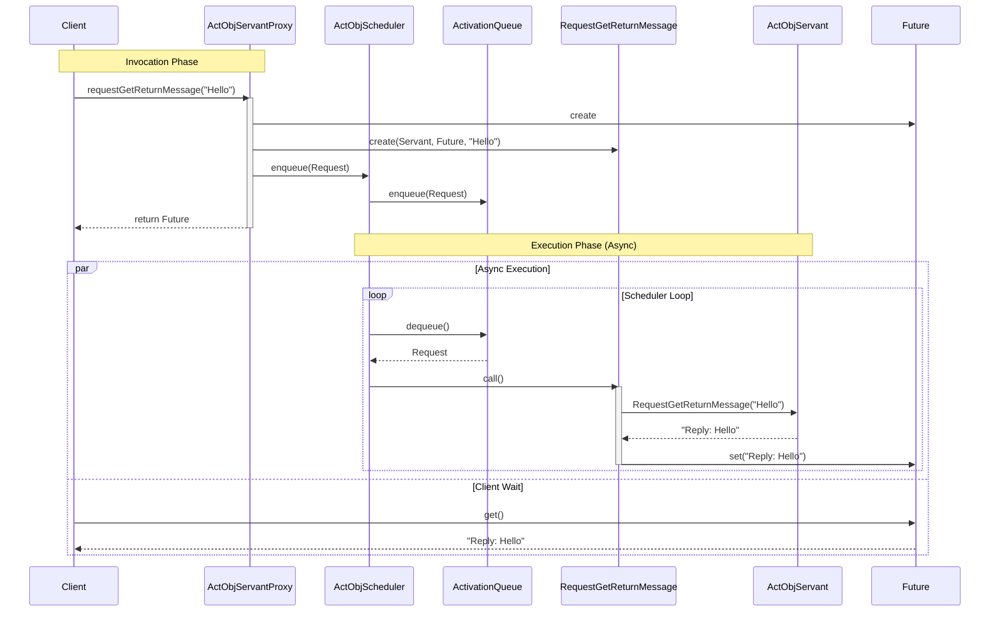

# Technical Specification

- **Title:** Active Object — Design Documentation
- **Author:** Jake Yoo
- **Date:** 2025-12-26
- **Version:** 0.1
- **Status:** Draft

## 1. Summary
- Create a design document for the specific part of the framework that applies the Active Object pattern, along with an example application to demonstrate it.

## 2. Goals & Non-Goals
- **Goals:**
  - Document the Active Object design pattern implementation.
  - Describe the example application for the Active Object framework.
  - Provide an overview of the architectural layout, including:
    - Class diagrams
    - Flow sequences
    - All diagrams should be written in Mermaid diagram format.
- **Non-Goals:**
  - Description of other design patterns implemented in the framework.

## 3. Context and Background
- To deepen knowledge of design patterns, I am implementing a simplified version of a framework and an example application to demonstrate the implemented framework.
- The part of the framework applying the Active Object pattern and the example application for demonstration have been implemented.
- It is required to create a design document for the implemented framework and example application.
- The design document will be used as a source for writing technical blog posts, such as:
    - https://yjung93.github.io/design%20pattern%20-%20ace%20framework/post-halfsync-halfasync/
    - https://yjung93.github.io/design%20pattern%20-%20ace%20framework/post-acceptor-connector/
    - https://yjung93.github.io/design%20pattern%20-%20ace%20framework/post-reactor/

## 4. Requirements
- **Functional Requirements:**
  - The system must allow method calls to be executed asynchronously.
  - The system must decouple method invocation from method execution.
  - The system must support returning results via Futures.
- **Non-Functional Requirements:**
  - Thread safety for the activation queue.
  - Clean separation of concerns between the proxy, scheduler, and servant.

## 5. High-Level Architecture
The Active Object pattern decouples method execution from method invocation for objects that each reside in their own thread of control. The goal is to introduce concurrency, by using asynchronous method invocation and a scheduler to handle requests.

### Class Diagram

## 6. Design Details

### 6.1 Framework Components
The framework provides the core building blocks for the Active Object pattern:

- **`ActivationQueue`**: A thread-safe queue that stores `MethodRequest` objects. It handles synchronization between the client thread (producer) and the scheduler thread (consumer).
- **`MethodRequest`**: An abstract base class representing a method call. It encapsulates the context (arguments, servant, future) required to execute the method.
- **`Future<T>`**: A proxy for a result that is initially not known. It allows the client to retrieve the result of the asynchronous operation once it is available.

### 6.2 Application Components
The example application demonstrates how to use the framework:

- **`ActObjServant`**: The actual object that implements the business logic. It is kept unaware of the concurrency model.
- **`ActObjServantProxy`**: The interface exposed to the client. It converts method calls into `MethodRequest` objects and enqueues them into the scheduler. It returns a `Future` to the client immediately.
- **`ActObjScheduler`**: Runs in a separate thread (inheriting from `Task`). It continuously dequeues `MethodRequest`s from the `ActivationQueue` and executes them.
- **`RequestGetReturnMessage`**: A concrete implementation of `MethodRequest`. It calls the specific method on `ActObjServant` and sets the result in the `Future`.

### 6.3 Execution Flow
The following sequence diagram illustrates the flow when a client invokes a method on the proxy.

## 7. Reference
- **Source Code:**
  - Framework (Active Object pattern):
    - [`framework/active_object/1_0/`](../../../../framework/active_object/1_0/)
  - Example Application:
    - [`applications/example_active_object/`](../../../../applications/example_active_object/)
